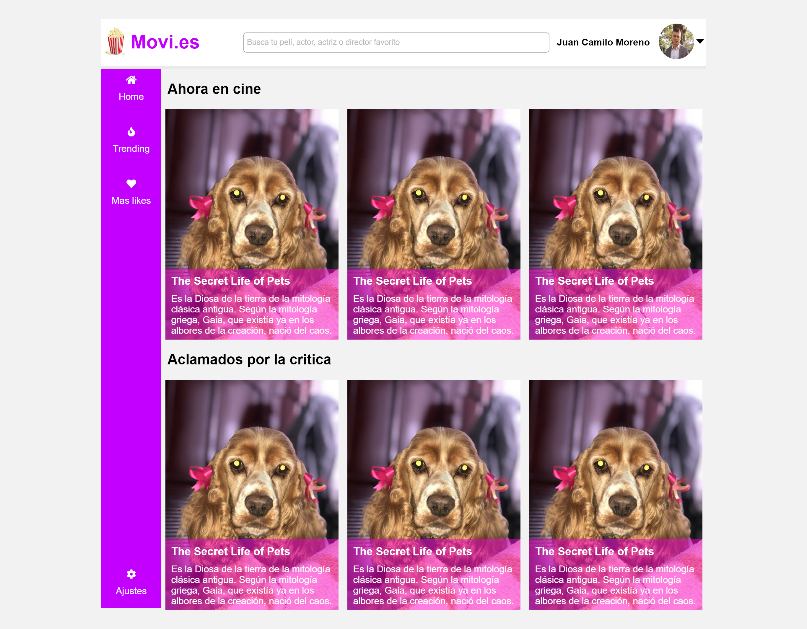
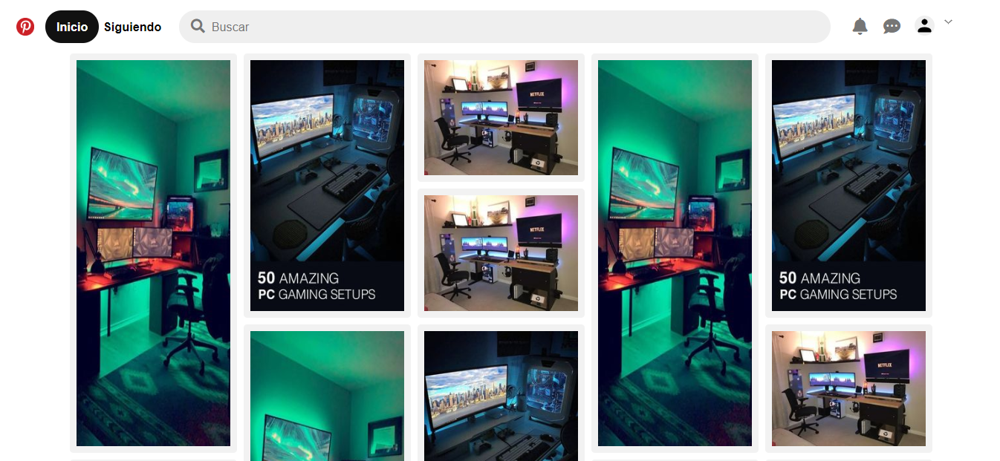

# CSS-Grid
Estas son las maquetaciones del proyecto del [Curso de CSS Grid Layout](https://platzi.com/clases/css-grid-layout/) de la plataforma de aprendizaje [Platzi](https://platzi.com/).
Contiene maquetas de paginas como Instagram, Pinterest, Platzi y una simulación de una pagina para ver películas llamada Movie.html. Todas las maquetas estan hechas en HTML y CSS utilizando CSS GRID.

## Comenzar 🛰
Para visualizar este proyecto lo único que necesitas es descargar el .zip o hacer un fork del proyecto y abrir el archivo:
- instagram.html si deseas ver el clon de instagram.
- platzi.html si deseas ver el clon de Platzi.
- Movies.html si deseas ver la pagina de películas.
- pinterest.html si deseas ver el clon de pinteres.

## Instalación ⚙
    git@github.com:JuanCamilo21/CSS-Grid.git

## Pre-requisitos 📝
Lo único que necesitas sera tu editor de código preferido y tu mejor actitud.

## Preview 👀
#### Movies

#### Pinterest

#### Platzi

## Tecnologías 💻

 - HTML
 - CSS
 - CSS Grid

## Autor 🙋🏼‍♂️

 - [Juan Camilo Moreno Gómez](https://github.com/JuanCamilo21)
 
## Agradecimientos 👏🏽
- Ana Belisa - Coach 👩🏽‍🏫
- Platzi Master 

1% Talento 🧠  99% Pasión 👨🏼‍💻❤️
